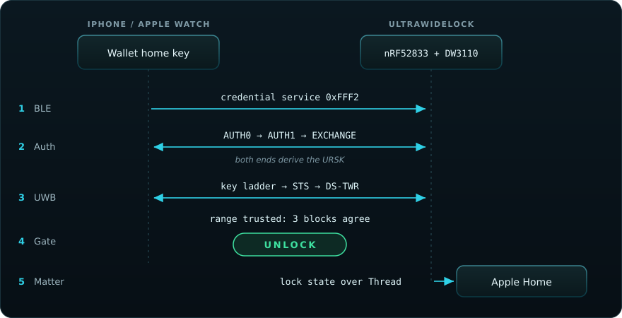

<div align="center">


**Portable firmware for NFC and UWB smart locks.**


</div>

UltraWideLock implements Aliro, the CSA door-lock credential standard, over BLE,
NFC and UWB on real hardware. One portable core behind five HAL seams drives
four lock applications, a second UWB anchor and standalone reader, initiator,
anchor and witness examples, across Zephyr, ESP-IDF and FreeRTOS.

## Features

| Feature | Description | Command |
|---|---|---|
| Credential | AUTH0, AUTH1, EXCHANGE, key ladder, provisioning and step-up over BLE | `make build` |
| UWB ranging | DS-TWR inside a CCC STS session, channels 5 and 9, FiRa session control | `make build` |
| NFC tap | ECP over an ST25R or PN532 reader on the nRF5340 DK | `make nrf-build` |
| Matter node | Hand-written Door Lock cluster, Approach Direction, UWB presence, five fabrics | `make build` |
| Matter client | Opens a second Matter lock over CASE through the Binding cluster | `make build CLIENT=1` |
| Thread | OpenThread MTD on the nRF parts | `make build` |
| Wi-Fi | Matter over Wi-Fi on ESP32-S3, C5 and C6 | `make esp-build APP=matter-lock` |
| Second anchor | A satellite joins the phone's own ranging round and returns a sealed distance | `make anchorlink` |
| BLE witnesses | Two dongles resolve inside from outside and latch the answer across a crossing | `make witness-build` |
| Obstruction classifier | Depth-2 decision tree over the DW3000 receive diagnostics, 776 B of flash | `make mlgate` |
| Delta updates | Signed P-256 deltas over BLE or USB through MCUboot | `make dfu` |
| Whole-image updates | Signed images over native GATT on ESP32 | `make esp-ota` |
| Serial recovery | A whole signed image over USB CDC-ACM, needing no starting image | `make ota-recovery` |
| FreeRTOS port | The same stack on the nRF52833 without Zephyr | `make freertos-build` |
| SDK | CMake package, umbrella header and per-role headers | `make sdk-export` |
| Digital twin | The ranging engine compiled to WebAssembly and replayed in a browser | `make test-twin` |
| Website | Guides, flasher, twin and subsystem graph, generated from this tree | `make docs-serve` |
| Host suite | 9,608 checks across 18 suites, no hardware | `make check` |

<div align="center"></div>

## Quick start

The host suite needs a C compiler and `python3`.

```sh
git clone https://github.com/ultrawidelock/ultrawidelock.git
cd ultrawidelock
make check
```

Bare targets build for the Qorvo DWM3001CDK.

```sh
make dfu-key                # once per clone   · the image-signing key
make bootstrap              # once per machine · NCS v3.3.0
make build                  # -> build/cdk-matter
make flash
make monitor
```

Adding the key needs an iPhone with UWB on iOS 26 or later, a home hub and a
Thread border router: [add the key](docs/add-the-key.md).

`make help` lists every target. `make tools` reports what this machine is missing.

<div align="center"></div>

## Unlock sequence

<div align="center">




<sub>A Wallet home key, on approach, recorded on hardware.</sub>


</div>

## Boards

| Application | Hardware | Connectivity |
|---|---|---|
| [`apps/dwm3001cdk-lock/`](apps/dwm3001cdk-lock/) | DWM3001CDK | UWB, Matter over Thread |
| [`apps/dwm3001cdk-lock-freertos/`](apps/dwm3001cdk-lock-freertos/) | DWM3001CDK, no Zephyr | UWB, Matter over Thread |
| [`apps/nrf5340dk-lock/`](apps/nrf5340dk-lock/) | nRF5340 DK, DWM3000EVB, NFC12A1 | UWB and NFC, Matter over Thread |
| [`apps/esp32-matter-lock/`](apps/esp32-matter-lock/) | ESP32-S3 / C5 / C6 with DWM3000EVB | UWB, Matter over Wi-Fi |
| [`apps/satellite/`](apps/satellite/) | CDK, nRF5340 DK, or the ESP32 tier | UWB responder, sealed link to the lock |

```sh
make nrf-build && make nrf-flash && make nrf-term    # nRF5340 DK
make esp-bootstrap && make esp-go APP=matter-lock TARGET=esp32s3
make freertos-build && make freertos-flash           # the Zephyr-free port
make sat-build && make sat-flash                     # the satellite
make hitl                                            # unattended end-to-end bench
```

| Example | Role | Build |
|---|---|---|
| [`examples/zephyr/anchor/`](examples/zephyr/anchor/) | Two-board anchor-to-anchor DS-TWR bench | `make anchor-pair` |
| [`examples/zephyr/ble-witness/`](examples/zephyr/ble-witness/) | The inside/outside dongle | `make witness-build` |
| [`examples/zephyr/nrf5340dk-initiator/`](examples/zephyr/nrf5340dk-initiator/) | A DK standing in for the phone | `make nrf-init-build` |
| [`examples/esp32/reader/`](examples/esp32/reader/) | The credential reader alone | `make esp-build APP=reader` |
| [`examples/esp32/initiator/`](examples/esp32/initiator/) | An ESP32 BLE initiator peer | `make esp-build APP=initiator` |
| [`examples/esp32/satellite/`](examples/esp32/satellite/) | The satellite on the ESP32 tier | `make esp-build APP=satellite` |
| [`examples/cmake/consumer/`](examples/cmake/consumer/) | An out-of-tree C consumer of the SDK | `make sdk-check` |

Apple Home and Home Assistant share one CDK and one Thread network:
the [multi-admin guide](apps/dwm3001cdk-lock/README.md#apple-home-plus-home-assistant).

<div align="center">
<picture>
  <source media="(prefers-color-scheme: dark)" srcset="assets/grid-demo-dark.webp">
  <source media="(prefers-color-scheme: light)" srcset="assets/grid-demo-light.webp">
  
</picture>
<br/>
<sub>Home Key · Approach Direction · provisioning · NFC tap · live lock state</sub>


</div>

## Updates

[**ultrawidelock.com/flash**](https://ultrawidelock.com/flash/index.html) finds
the board, reads what it is running and sends the one update that applies.
Chrome or Edge on a computer, Chrome on Android.

| | DWM3001CDK | ESP32-S3 / C5 / C6 |
|---|---|---|
| Transport | mcumgr, over BLE **or** USB | Native GATT frames |
| Payload | Signed delta, ~11 KB | Signed whole image, ~2 MB |
| Slots | One MCUboot slot in 512 KB | Two full OTA slots |
| Time | Seconds | Several minutes over BLE |

Writing starts once the update window is open on the board: **SW2** on the CDK, a
**double-click** on the ESP32's button. Authenticity is a P-256 signature,
checked before the first byte is written and again by the bootloader.

The CDK also reinstalls whole over that cable through MCUboot serial recovery,
which runs from the bootloader alone.

```sh
make fota                   # CDK: one file a phone can install
make fota-done              # after every phone push, to record what the board runs
make ota-fan  PREV_HEXES=…  # the delta fan and the index the web page reads
make release  RELEASE_KEY=… # the published bundle
```

`make fota-done` is required: a CDK delta is cut against the exact bytes on the
part, and only the build host keeps that record.

<div align="center"></div>

## In a browser

[**ultrawidelock.com**](https://ultrawidelock.com) is generated from this tree by
stdlib Python. `make docs-serve` serves it on `localhost:8080`.

| Page | Contents |
|---|---|
| [Guides](https://ultrawidelock.com/docs/index.html) | Every file in [`docs/`](docs/), with search, a contents rail and a reading order |
| [Digital twin](https://ultrawidelock.com/twin/index.html) | The ranging engine in WebAssembly: walk a phantom phone, add noise, fire a Ghost-Peak spoof, single-step a DS-TWR round |
| [Flash](https://ultrawidelock.com/flash/index.html) | Install an ESP32 over the cable, or update either chip over the air |
| [Graph](https://ultrawidelock.com/graph/index.html) | The subsystem graph, generated from the source tree |

The twin compiles the untouched `modules/ultrawidelock_uwb` sources against the
host shim the test suite links, so every block is a real CCM*-encrypted exchange
decoded by the firmware's own RX state machine.

<div align="center"></div>

## Verification

```sh
make check                  # 18 host suites, 9,608 checks, no hardware
make ci                     # every pull-request gate, in CI's order
make regress                # everything a machine can check without a board
make regress-hil            # and then on air, against a live reader
```

| Gate | Enforces |
|---|---|
| `make seam` | Every call to the radio passes the CCC STS seam |
| `make scope` | Vendor radio APIs are named only in the DW3000 engine file set |
| `make purity` | `modules/` names no OS, and each port tree names only its own |
| `make drift` | Constants and integration patch sets match the C they are copied from |
| `make cdk-size-check` | The image keeps its flash and RAM headroom |
| `make lint` / `make sca` | cppcheck and Clang Static Analyzer over the portable tree |
| `make cbmc` | The wire parsers are proved memory-safe |
| `make test-san` | The host suite passes again under ASan and UBSan |
| `make coverage` | Line coverage, with 0% rows for what no suite reaches |
| `make docs-check` | Every internal link resolves, and three constant tables match their C |

`make sdk-check` builds an out-of-tree C consumer against the installed CMake
package. `make app-diff` diffs this tree's door-lock app against pinned upstream.
`make instrument` serves a latency dashboard captured from a real board.

<div align="center"></div>

## SDK

```c
#include <ultrawidelock/reader.h>     // the lock side
#include <ultrawidelock/device.h>     // the initiator side
#include <ultrawidelock/tlv.h>        // the codec alone
```

Ports implement the five seams in `<ultrawidelock/ultrawidelock_hal.h>`: DW3000
GPIO/IRQ, DW3000 SPI, reader BLE, central BLE and credential storage. New board
or chipset: [`PORTING.md`](PORTING.md). Consuming the CMake package directly:
[reference](docs/reference.md).

<div align="center"></div>

## Documentation

| | |
|:--|:--|
| **Start** | [configuring](docs/configuring.md) · [add the key](docs/add-the-key.md) · [troubleshooting](docs/troubleshooting.md) |
| **Boards** | [ESP32 bring-up](docs/esp32-bringup.md) · [ESP32 gotchas](docs/esp32-gotchas.md) · [nRF5340 bring-up](docs/nrf5340-bringup.md) · [nRF5340 wiring](docs/nrf5340-wiring.md) · [DWM3001CDK surgery](docs/dwm3001cdk-surgery.md) · [hardware validation](docs/hardware-validation.md) |
| **Porting** | [porting](docs/porting.md) · [porting to ESP32](docs/porting-esp32.md) · [chipset memory](docs/chipset-memory.md) |
| **Protocol** | [notes](docs/protocol-notes.md) · [research](docs/protocol-research.md) · [range integrity](docs/range-integrity.md) · [approach direction](docs/approach-direction.md) · [UWB MAC login](docs/uwb-mac-login.md) · [Door Lock events](docs/matter-door-lock-events.md) · [Matter binding](docs/matter-binding.md) · [binding bench](docs/matter-binding-bench.md) · [BodyCal](docs/bodycal-falsification.md) |
| **Side of door** | [inside latch](docs/inside-latch.md) · [second anchor](docs/second-anchor.md) · [bench runbook](docs/bench-inside-outside.md) |
| **Reference** | [reference](docs/reference.md) · [changelog](CHANGELOG.md) · [contributing](CONTRIBUTING.md) · [coding agents](AGENTS.md) |

<div align="center"></div>

## Repository layout

```text
ultrawidelock/
├── apps/           complete lock products
├── examples/       independently buildable role and bench examples
├── modules/        the portable protocol, with no OS in it
│   ├── ultrawidelock_cred/       credential sessions, TLV, key ladder
│   ├── ultrawidelock_cred_stack/ that stack, adapted into the Nordic app
│   ├── ultrawidelock_uwb/        ranging engine behind the STS seam
│   ├── ultrawidelock_dw3000/     DW3000 driver integration
│   ├── ultrawidelock_anchor/     side of door: fusion, latch, witnesses, seal
│   ├── ultrawidelock_matter/     the hand-written Matter node
│   ├── ultrawidelock_ml/         on-device classifiers
│   ├── ultrawidelock_nfc/        ECP and reader transports
│   ├── ultrawidelock_dfu/        signed delta updates
│   └── ultrawidelock_port/       the OS, flash, log and byte-order contracts
├── ports/          zephyr · esp32 · freertos-nrf52833
├── integrations/   patches for external upstream applications
├── tests/          host, shared, port, tooling, sdk, on-target
├── include/        SDK umbrella and public-API ownership
├── cmake/          shared CMake helpers
├── mk/             what sits behind each Make target
├── scripts/        setup, release, DFU, sizing, device utilities
├── docs/           the guides, read on GitHub and published to the site
├── web/            the site, the flasher, the WASM twin, the graph
└── release/        templates and scripts for release bundles
```

<div align="center"></div>

## FAQ

**What is needed to add the key?** An iPhone with UWB on iOS 26 or later, a home
hub such as a HomePod or Apple TV, and the network the target joins: a Thread
border router for the nRF boards, 2.4 GHz Wi-Fi for ESP32. The image ships no
credential; Apple Home mints the Aliro key during Matter commissioning.

**Which board should come first?** The Qorvo DWM3001CDK. It carries the nRF52833,
the DW3110 radio and a J-Link on one module, and every bare `make` target builds
for it.

**Can it be tried without hardware?** Yes. `make check` runs the whole host
suite, and the [digital twin](https://ultrawidelock.com/twin/index.html) runs the
firmware's own ranging engine in a browser.

**Does the phone have to be awake?** No. An NFC tap is validated in Express Mode
with the screen off ([HV-5](docs/hardware-validation.md)).

**Where does the console come from?** RTT, not UART. `make monitor` attaches with
the ELF that was flashed. The ring survives reset, so the first block belongs to
the previous run.

**What does `make flash-erase` cost?** The commissioning. Apple Home has to add
the lock again, and Home Assistant has to be shared again afterward.

**Can one lock open another?** Yes. `make build CLIENT=1` compiles the Matter
client role, which opens a bound lock over CASE through the Binding cluster.

> [!WARNING]
> These are bench defaults. Do not secure valuables with them, and never lock
> APPROTECT: recovery needs a mass erase, which takes the reader's private key
> and every phone key on it. `scripts/check-approtect.sh` checks a part.

<div align="center"></div>

## License

Project-original code is Copyright (c) 2026 asxeem and UltraWideLock
contributors under the ISC license ([LICENSE](LICENSE)). The DW3000 integration
in `modules/ultrawidelock_dw3000` is ISC (Bruno Randolf).

The vendored Qorvo UWB driver it wraps is LicenseRef-QORVO-2, which permits use
only with Qorvo integrated circuits, so **binaries built with UWB support
inherit that hardware restriction**. Full mapping:
[THIRD_PARTY_NOTICES](THIRD_PARTY_NOTICES).
